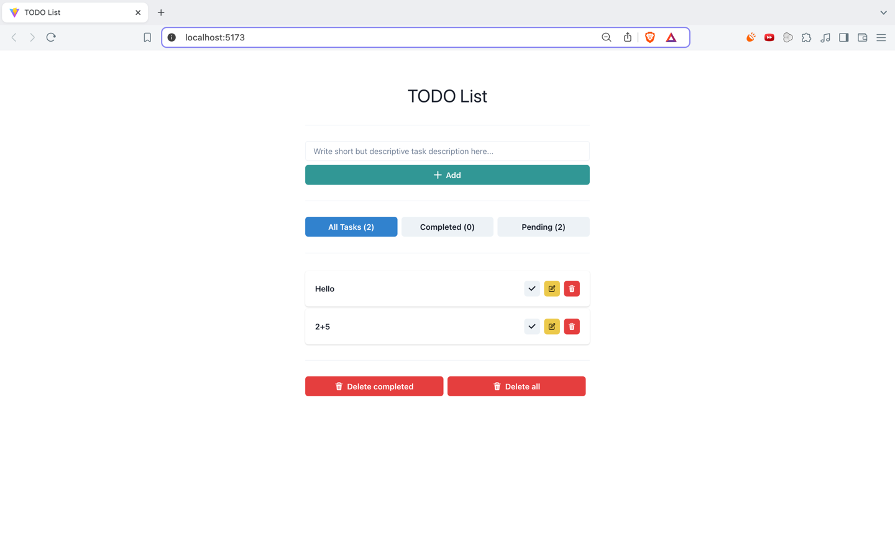

# Spring Boot and React To-Do App

### Summary
This is yet another to-do app. Like the other _-probably-_ millions of similar to-do apps on the Internet, this app can be used for keeping track of your tasks.
Allows you to create tasks on its simple and clean interface. You can also mark the tasks as completed or delete them.


### Technologies
- JDK 17
- Spring Boot with Maven
- Swagger
- PostgreSQL
- React
- Chakra UI
- Vite
- TypeScript
- Docker

### Running

Clone the app
```commandline
git clone https://github.com/SwarnimRaj/spring-react-todo-app.git todo-app
```

Firstly, you need to initialize a PostgreSQL database. You can do that with Docker:
```shell
docker run --name postgres -e POSTGRES_PASSWORD=secret -e POSTGRES_USER=myuser -p 5432:5432 -d postgres
```

To connect to db,
```
PGPASSWORD=secret psql -h localhost -p 5432 -U myuser postgres
```

Then, you can run the backend by starting [SpringTodoAppApplication](src/main/java/com/ahkn/springtodoapp/SpringTodoAppApplication.java) in debug mode from IntelliJ

After that, you can run the frontend with the following commands:

```shell
cd frontend
npm install
npm run dev
```

Navigate to http://localhost:5173/ and start adding tasks


Docker Clean-up commands:
```
docker kill $(docker ps -q)
docker rm $(docker ps -a -q)
```